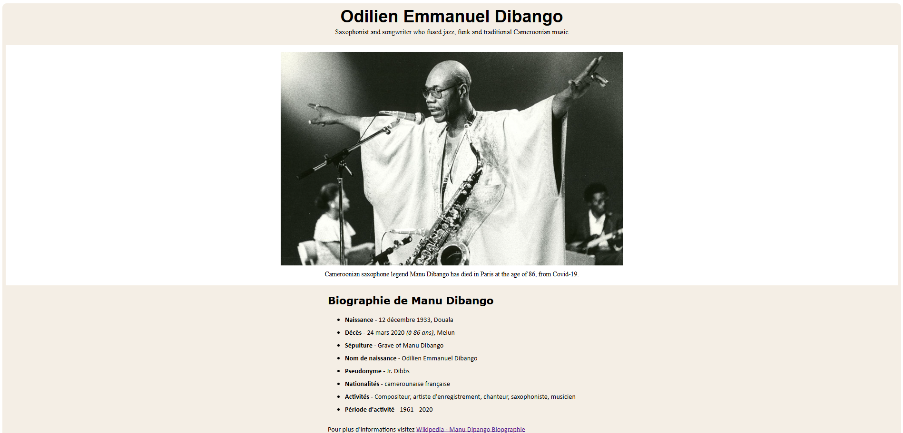

# 🕊 Page d'Hommage

Ce projet est une page d’hommage de **Manu Dibango** construite dans le cadre du **certificat en design web responsive** de FreeCodeCamp. L'objectif est de créer une page informative et élégante mettant en avant une personnalité inspirante.

## 🚀 Démo en ligne
🔗 [Lien vers la démo](https://lil-code30.github.io/page-d-hommage/)

## 🛠️ Technologies utilisées
- **HTML5** – Structure de la page
- **CSS3** – Mise en page et design responsive

## 🎯 Fonctionnalités
✅ Mise en page fluide et responsive  
✅ Intégration d'images et de citations inspirantes  
✅ Section biographique détaillée  

## 📸 Aperçu du projet
<div align="center">
  
  <p><em> Aperçu du projet</em></p>
</div>

## 📥 Installation et Utilisation
1. **Clone le dépôt**  
   ```bash
   git clone https://github.com/Lil-Code30/page-d-hommage.git
2. Ouvre ```index.html``` dans un navigateur pour voir la page.
